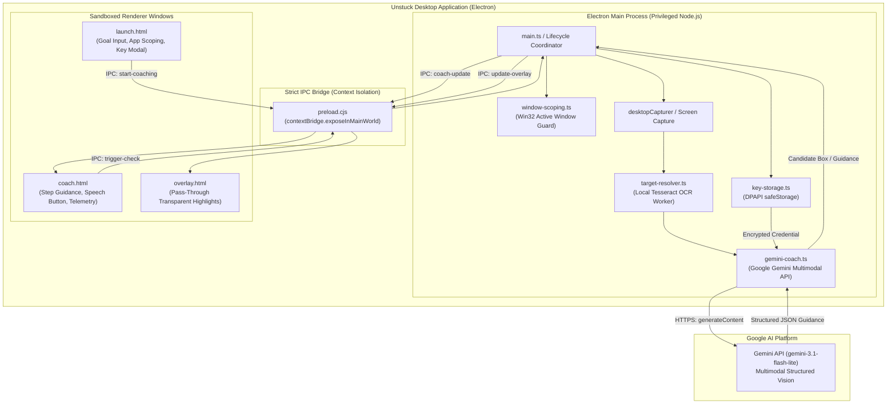

# Unstuck — Interactive AI Desktop Software Coach

<div align="center">


**"Your screen. One clear next move."**

Meet **Nori**, an interactive desktop pair coach guiding beginners through multi-step software tasks with on-demand screen observation, local OCR grounding, pass-through visual overlays, step-by-step progress verification, and mistake recovery.

[Download Windows Installer](#-download--installation) • [Architecture](#-system-architecture) • [Key Features](#-key-features) • [Visual Walkthrough](#-visual-walkthrough) • [Developer Guide](#-developer-guide)

</div>

---

## 💾 Download & Installation

The standalone Windows desktop application is distributed as a per-user NSIS installer. No terminal, Git checkout, or `.env` configuration file is required for end users.

### Official Windows x64 Release
* 📥 **[Download Unstuck Setup 1.0.0.exe](https://github.com/akashgamerz6575-spec/Unstuck/releases/download/v1.0.0/Unstuck.Setup.1.0.0.exe)** *(~120.7 MB | Version 1.0.0)*
* 🔑 **SHA-256 Checksum:** `8B37061ABB5F890423934A11411D011CBAD130C3EC81ACAE0AC220DB046FC4AE`
* 📦 **Release Page:** [GitHub Releases v1.0.0](https://github.com/akashgamerz6575-spec/Unstuck/releases/tag/v1.0.0)

### Quick Setup Steps
1. **Download & Run:** Download `Unstuck.Setup.1.0.0.exe` and launch it. It installs into `%LOCALAPPDATA%\Programs\Unstuck` without requiring Windows administrator privileges.
2. **Windows SmartScreen Notice:** Unstuck is an open-source project and is not signed with a paid commercial Extended Validation (EV) certificate. When Windows displays the *"Windows protected your PC"* banner, click **More info** followed by **Run anyway**.
3. **First-Run API Key Setup:**
   - On first launch, Nori opens the built-in Gemini Key setup modal.
   - Enter your personal Gemini API key from [Google AI Studio](https://aistudio.google.com/app/apikey).
   - Click **Test connection** to verify connectivity with Google's servers.
   - Click **Save key**. Your key is encrypted using Windows DPAPI via Electron's `safeStorage` at `%APPDATA%\Unstuck\gemini_credential.enc`.
   - Your key is never stored in plaintext, never logged, never exposed to web renderers, and never sent anywhere other than Google's official Gemini API endpoint.
   - You can replace or remove your key at any time by clicking the **Gemini Key** chip in the title bar.

---

## ✨ Key Features

| Capability | How It Works | Benefit |
|---|---|---|
| **On-Demand Vision** | Takes a single screen snapshot only when the user clicks **Check** or presses `Ctrl+Alt+U`. Coach and overlay windows automatically hide during capture to avoid obscuring the target application. | Zero background recording or surveillance; complete user privacy and bounded API budget. |
| **Grounded Control Targeting** | Identifies on-screen text buttons and menu controls locally with an embedded Tesseract OCR worker, mapping Gemini's structured intent to physical screen coordinates. | Draws high-contrast pass-through bounding-box highlights over verified controls without guessing arbitrary coordinates. |
| **Progress Verification** | Each coaching turn evaluates visible software changes against the active goal before advancing the step counter. | Prevents false progress; user must actually select the data range or configure the control on screen. |
| **Contextual Mistake Recovery** | Detects deviations (such as opening the wrong menu or picking Pie chart instead of Bar chart) and issues corrective steps while preserving the original goal. | Beginners never get permanently stuck or lost after an incorrect click. |
| **Zero-Leak Secret Isolation** | API keys are managed exclusively in Electron's Main process with OS-level DPAPI encryption. Only masked representations (`••••••••3aBc`) cross IPC boundaries. | Prevents credential leaks in renderer state, window titles, screenshots, or logs. |
| **Local Text-to-Speech** | Accessible speaker button beside each instruction reads the next move aloud via the browser Web Speech API. | Hands-free guidance so users can keep their eyes on the target application. |
| **Application-Agnostic Guidance** | Supports arbitrary desktop software (e.g. creative suites, 3D tools) in text guidance mode alongside the specialized LibreOffice Calc overlay benchmark. | Flexible assistance across desktop workflows without claiming unverified automation. |
| **Optional Video Reference** | Supply a public YouTube tutorial URL to seed high-level reference steps analyzed once per coaching session. | Connects video tutorials with real-time screen reality. |

---

## 🏛 System Architecture

Unstuck is engineered with strict process isolation, sandboxed WebPreferences, and narrow IPC surfaces:



### Architectural Guiding Principles
1. **Secret Isolation:** The Gemini API key never enters renderer memory or DOM state. It is injected into outbound HTTPS request headers exclusively from the Electron main process.
2. **Untrusted Input Defense:** Model outputs, OCR candidate strings, and visible screen text are treated as untrusted data. They are validated against TypeScript schemas before rendering and can never execute code or override safety contracts.
3. **Window Invisibility Protocol:** Before capturing a screenshot, Unstuck hides its own coach panel and transparent overlay, yields briefly for OS compositor redraw, captures the monitor, and restores the windows. Unstuck never captures itself.
4. **Pass-Through Interaction:** The overlay window uses `setIgnoreMouseEvents(true, { forward: true })`, ensuring all user clicks pass through seamlessly to the target application.

---

## 📸 Visual Walkthrough

The following screenshots demonstrate Unstuck's visual observation, candidate grounding, progress verification, and mistake recovery in a real LibreOffice Calc workflow:

### Step 1: Selection Recognition

*When the user triggers Check with only an unrelated cell focused, Gemini observes that the required data range `A1:B5` is unselected. Rather than advancing prematurely, Nori highlights the table range and instructs the user to select cells A1 through B5 first.*

### Step 2: Progress Advancement

*Once the user selects `A1:B5`, Gemini verifies the visible selection evidence on screen and advances to Step 2 (*Open Chart Wizard*), drawing a grounded highlight box directly targeting the `Insert` menu / Chart icon.*

### Step 3: Wrong-Chart Mistake Recovery

*When the user deviates and creates a Pie chart instead of the requested horizontal bar chart, Gemini detects the discrepancy from visible screen evidence. It refrains from false progress, displays the amber `CORRECTION` badge, and gives step-by-step instructions to change the chart type to Bar.*

### Step 4: Verified Completion

*Once the user switches to a horizontal bar chart with the correct data range (`A1:B5`) and title (*"Requests by department"*), Gemini visually validates the finished chart against all goal criteria and displays the soft sage `COMPLETE` badge.*

---

## 💻 Developer Guide

### Prerequisites
* **Node.js:** v20.x or higher (tested on Node v20.x and v24.x)
* **npm:** v10.x or higher
* **OS:** Windows 10/11 (for native desktop overlay & capture) or any OS (for web companion & test suite)
* **Google Gemini API Key:** Optional for running automated tests; required for live coaching turns (obtain from [Google AI Studio](https://aistudio.google.com/)).

### Local Development Setup

```bash
# 1. Clone repository
git clone https://github.com/akashgamerz6575-spec/Unstuck.git
cd Unstuck

# 2. Install dependencies
npm ci

# 3. (Optional for local CLI dev) Configure development key
copy .env.example .env
# Edit .env and paste your GEMINI_API_KEY

# 4. Compile TypeScript & copy static assets
npm run build
```

### Running Applications

```bash
# Run Windows Desktop Application
npm start

# Run Developer Mock UI (inspect all 9 coach visual states offline)
npm run mock-ui

# Run Web Companion locally on http://localhost:8080
npm run web
```

### Running Test Suites

Unstuck includes a comprehensive suite of 122 automated tests executed with the native Node.js test runner (`node --test`), requiring zero external test runner dependencies:

```bash
# Run type checking
npm run typecheck

# Run full unit test suite (122 tests across 33 suites)
npm test

# Run integration tests (requires live GEMINI_API_KEY in .env)
npm run test:integration
```

The test suites cover:
- Coordinate conversion & 125% DPI scale transformation
- Crop geometry & window boundary clamping
- Gemini API key secure storage (safeStorage DPAPI & secret isolation)
- Request lifecycle, monotonic IDs, and cancellation invariants
- Multi-part response assembly and thought-part filtering
- Network diagnostics and DNS error code classification
- Web session manager lifecycle and rate pacing limits

### Building the Windows Installer

To produce a production-ready Windows NSIS installer:

```bash
npm run build:installer
```

Build outputs are saved to `release/`:
- `release/Unstuck Setup 1.0.0.exe` (NSIS installer binary, ~120.7 MB)
- `release/Unstuck Setup 1.0.0.exe.blockmap` (Blockmap for differential updates)

Calculate the installer checksum in PowerShell:
```powershell
Get-FileHash -Path "release\Unstuck Setup 1.0.0.exe" -Algorithm SHA256
```

---

## 🔒 Privacy & Security Model

* **On-Demand Capture Only:** Screen capture occurs strictly upon explicit user interaction (pressing **Check** or `Ctrl+Alt+U`). Unstuck never streams continuous video or conducts background monitoring.
* **OS-Level Key Encryption:** Personal API keys are encrypted at rest using Windows Data Protection API (`safeStorage.encryptString`) under `%APPDATA%\Unstuck\gemini_credential.enc`.
* **Zero Secret Exposure:** Keys are never passed over IPC to renderer frames, never embedded in application builds, never written to log files, and never committed to source control.
* **Ephemeral Processing:** Screenshot buffers are analyzed in-memory and discarded upon completion of the coaching turn.
* **Uncompressed Sandboxing:** All Electron browser windows run with `contextIsolation: true`, `nodeIntegration: false`, and `sandbox: true`.

---

## ⚠️ Known Limitations & Boundaries

* **Single Primary Display:** The desktop overlay measures and aligns coordinates against the primary display under dynamic OS DPI scaling (tested baseline: 125% DPI). Multi-monitor spans are currently out of scope.
* **LibreOffice Calc Preset:** Grounded coordinate bounding-box overlays are strictly verified for LibreOffice Calc tabular workflows. Generic software uses actionable text guidance without coordinate overlays.
* **No Simulated Clicks:** Unstuck is an interactive pair coach, not an autonomous agent. It highlights targets and instructs users, but never moves the mouse or types on the user's behalf.
* **API Rate Pacing:** Desktop and web sessions enforce a minimum 5-second interval between checks and a 15-request session budget to protect against upstream HTTP 429 quota exhaustion.

---

## 🚢 Release Procedure

To publish a verified release:
1. Ensure all code passes type checking (`npm run typecheck`) and the full test suite (`npm test`).
2. Build the installer (`npm run build:installer`).
3. Compute the SHA-256 hash of the generated installer executable.
4. Verify the installed application outside development directories without `.env`.
5. Commit source changes to `main` and create an annotated Git tag (e.g. `v1.0.0`).
6. Create a GitHub Release matching the tag and upload the installer (`.exe`) and checksum file (`.sha256`) as release assets.
7. Keep installer binaries and unpacked builds out of Git history to maintain the strict repository budget (< 10 MB).

---

## 📄 License

This project is open-source software licensed under the [MIT License](LICENSE).