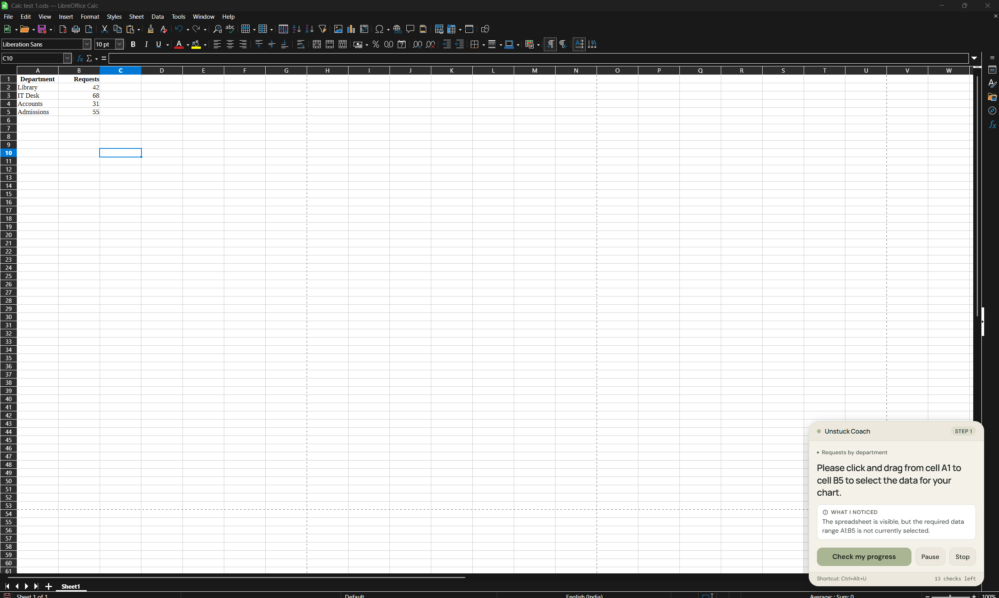
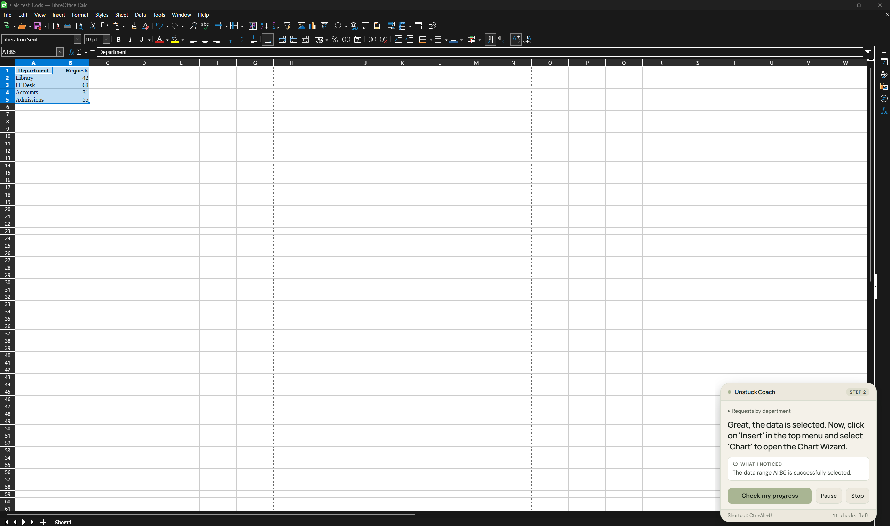
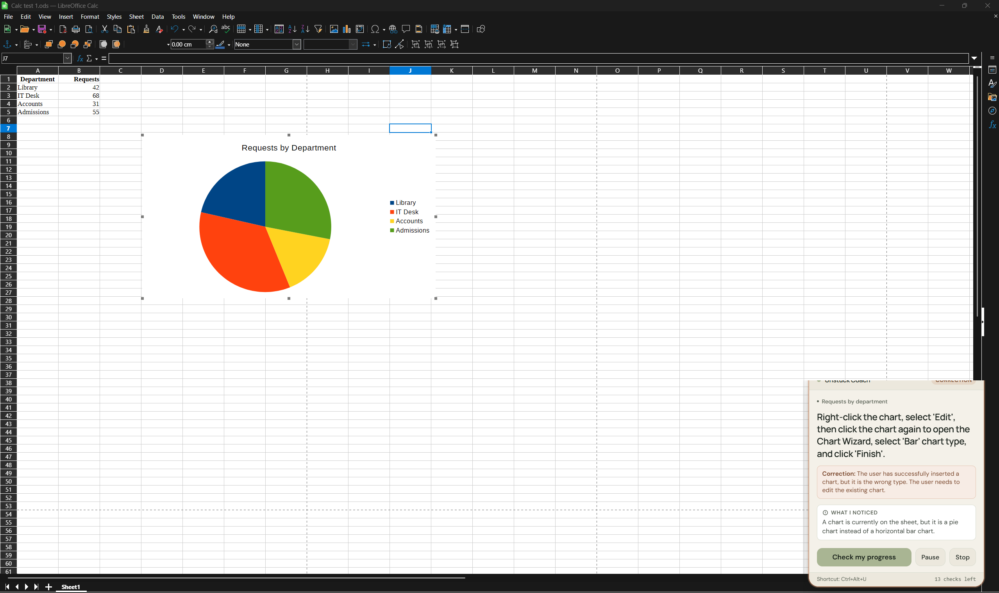
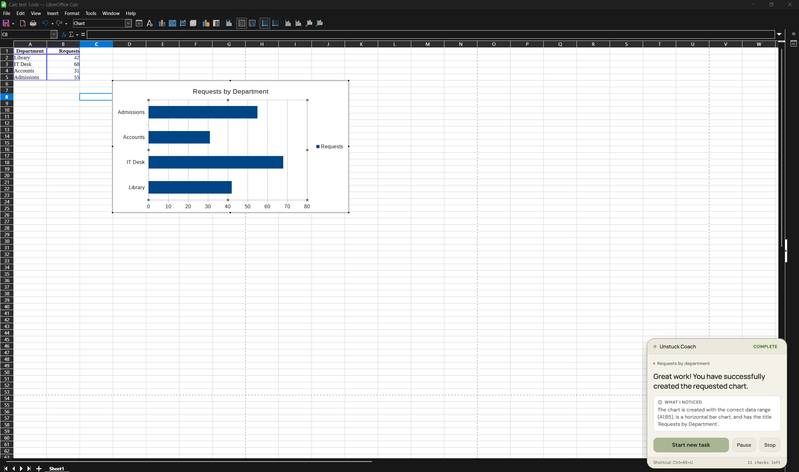

# Unstuck — Interactive Desktop Software Coach

> **"Your screen. One clear next move."**  
> Meet **Nori**, an interactive desktop pair coach guiding beginners through complex desktop software tasks with on-demand screen observation, local OCR grounding, pass-through visual overlays, progress verification, and mistake recovery.
> 
> 🌐 **Live Web Companion:** [https://unstuck-nori.onrender.com/](https://unstuck-nori.onrender.com/)  
> 📦 **GitHub Repository:** [https://github.com/akashgamerz6575-spec/Unstuck](https://github.com/akashgamerz6575-spec/Unstuck)

---

## 1. Google Technologies Used

Unstuck integrates Google AI technologies at its core while clearly separating runtime services from development tooling:

| Google Technology | Role in Project | Specific Implementation & Source | Why It Is Central |
|---|---|---|---|
| **Google Gemini API** *(Runtime Service)* | Multimodal reasoning engine that inspects desktop screenshots, assesses user progress against the active goal, suggests the next step, and verifies visible task completion. | Default model: `gemini-3.1-flash-lite` (latency ~2.8s; configurable via `GEMINI_MODEL`, comparison model `gemini-3.8-flash`).<br>Desktop: [`electron/gemini-coach.ts`](electron/gemini-coach.ts)<br>Web Server: [`server/gemini-service.ts`](server/gemini-service.ts) | Unstuck cannot function with traditional heuristics or pure OCR. Gemini provides the multimodal vision intelligence to understand dense software GUIs, detect errors (e.g. wrong chart types or unselected data ranges), and verify visual completion. |
| **Google Antigravity** *(Development Tooling)* | Advanced agentic AI development environment and IDE. | Used across all development milestones to inspect requirements, implement architecture, execute test suites, debug multimodal edge cases, and maintain repository budget. | Accelerated rapid prototyping, zero-hallucination coordinate refactoring, containerization, and automated test suite creation. |
| **Google AI Studio** *(Developer Platform)* | API key provisioning, model capability exploration, and quota monitoring. | Key management in developer environment and live token quota inspection for the Unstuck project. | Enabled fine-tuning system prompts, inspecting token budgets, and testing structured JSON schema generation. |

### Material Non-Google Technologies
To ensure strict truthfulness and avoid claiming unused Google products:
- **GitHub:** Source repository hosting and version tracking ([Repository](https://github.com/akashgamerz6575-spec/Unstuck)).
- **Render:** Cloud container deployment platform hosting the portable Unstuck Web Companion.
- **Electron:** Native desktop application framework providing Win32 window scoping, display metrics, and transparent pass-through overlays.
- **Node.js & TypeScript:** Runtime environment and strictly typed language (`strict: true`) across the entire repository.
- **Tesseract.js:** Local client-side and server-side English OCR engine used strictly for grounded text-candidate extraction.

---

## 2. Problem & Solution

Beginners frequently stall when learning multi-step desktop software (such as spreadsheets, CAD, or creative suites) because:
1. Toolbars and menus contain hundreds of dense, unfamiliar icons.
2. Static video tutorials don't know the user's current screen state or if they took a wrong turn.
3. Chatbots return walls of text without seeing the screen or pointing to the correct control.

**Unstuck** solves this with **Nori**, acting as an on-demand, non-intrusive pair coach:
- **Observes on Demand:** Takes an instant snapshot only when the user clicks **Check** or presses `Ctrl+Alt+U`.
- **Grounded Targeting:** Detects recognizable text controls locally with English OCR and highlights the target control with a transparent pass-through overlay—**never** guessing or hallucinating arbitrary coordinates.
- **Progress Verification:** Validates visible screen evidence before advancing step counters.
- **Mistake Recovery:** If the user deviates (e.g. opens the wrong menu or creates a Pie chart instead of a Bar chart), Unstuck detects the discrepancy and guides them back to the target path without losing the active goal.

---

## 3. Demonstration Evidence & Provenance

To adhere strictly to truthfulness, we clearly categorize all demonstration evidence across testing tiers:

| Tier | Test Scope | Evidence & Provenance | Verification Status |
|---|---|---|---|
| **Manual Desktop (Real Calc)** | Cell 46000 in C2 identified after manual rearrangement; guided to apply yellow fill; check verified completion. | Conducted live by Akash in a real LibreOffice Calc sheet on Windows 11. | **Verified** for that specific highlighting scenario. *(Note: Does not establish that Nori guided the sorting/ranking task or works universally).* |
| **Application-Agnostic Desktop Coach** | Arbitrary software foreground capture, dynamic window scoping, zero-OCR text guidance, tutorial video context. | Implemented via `isValidTargetWindow`, prompt contracts, and YouTube `fileData` preview input. Blender & UE5 manual checks marked pending (software not installed). | **Verified:** 16 automated unit tests passing. Manual checks for uninstalled apps pending. |
| **Automated Unit Tests** | 106 tests across 31 suites covering coordinate math, crop geometry, request lifecycle, model response assembly, application-agnostic guidance, tutorial processing, and network diagnostics. | Executed via `npm test` using Node.js native test runner (`node --test`). | **Verified:** 106 passing, 0 failing. |
| **Live Gemini on Fixtures** | 3-column table cell evaluation (`fixtures/calc-three-column-*.png`). | Executed live with Google Gemini API against synthetic fixtures created using Pillow. | **Verified on Synthetic Fixture:** C5 correctly identified; synthetic yellow fill verified. |
| **Local Browser Companion** | Web server endpoints, health checks, clean Calc scenarios, and candidate grounding. | Executed locally on `http://localhost:8080` with mock-safe scenario exploration. | **Verified:** All routes, rate pacing, and responsive UI working. |
| **Public Render Deployment** | Live web service accessible to judges and reviewers at [https://unstuck-nori.onrender.com/](https://unstuck-nori.onrender.com/). | Deployed Docker Web Service on Render with live health check `/healthz` and live Gemini multimodal analysis verified. | **Verified Live** (HTTP 200, valid multimodal vision guidance). |

### Visual Walkthrough of Verified Windows 11 Workflow
The following live desktop execution screenshots demonstrate Unstuck's visual observation, grounding, progress verification, and mistake recovery in real time:

#### Step 1: Selection Recognition

*Figure 1: **Selection Recognition.** When the user triggers Check with only an unrelated cell (`C10`) focused, Gemini observes that the required data range `A1:B5` is unselected. Rather than advancing prematurely, the coach highlights `A1:B5` and directs the user to select the tabular range first.*

#### Step 2: Progress Advancement

*Figure 2: **Progress Advancement.** Once the user highlights `A1:B5`, Gemini verifies the visible selection evidence on screen and advances to Step 2 (*Open Chart Wizard*), drawing a grounded highlight box targeting the `Insert` menu / Chart icon.*

#### Step 3: Wrong-Chart Mistake Recovery

*Figure 3: **Wrong-Chart Mistake Recovery.** When the user deviates and creates a Pie chart instead of the requested horizontal bar chart, Gemini detects the discrepancy from visible screen evidence. It refrains from false progress, displays the warm amber `CORRECTION` badge, and gives step-by-step instructions to enter edit mode and change the chart type to Bar.*

#### Step 4: Verified Completion

*Figure 4: **Task Completion.** Once the user switches to a horizontal bar chart with the correct data range (`A1:B5`) and title (*"Requests by department"*), Gemini visually validates the finished chart against all goal criteria and displays the soft sage `COMPLETE` badge.*

> **Important Fixture Provenance Disclosure:** For web companion analysis examples, clean Calc-only screenshots are provided in `fixtures/` (`calc-clean-unselected.png`, `calc-clean-selected.png`, `calc-clean-pie-chart.png`, `calc-clean-bar-chart.png`). These are **processed fixtures derived from real Windows 11 captures**: the bottom-right coach card area was replaced with reconstructed spreadsheet grid lines to eliminate prior coaching text and answer hints from the image, ensuring multimodal vision models evaluate the software interface directly. For full technical audit and reliability records, see [docs/judging_readiness.md](docs/judging_readiness.md).

---

## 4. Judging Criteria Evidence Table

| Criterion | Implementation | Relevant Source & Tests | Status |
|---|---|---|---|
| **1. Code Quality** | Clean process separation (Electron Main, Preload, Web Server, Web UI). Strict TypeScript (`strict: true`). Zero `any` leaks. Narrow validated IPC bridges. | [`electron/main.ts`](electron/main.ts)<br>[`shared/contract.ts`](shared/contract.ts)<br>[`server/server.ts`](server/server.ts) | **Verified** |
| **2. Security** | `GEMINI_API_KEY` isolated exclusively to backend/server environments via `x-goog-api-key` header. Zero credentials exposed to renderer, URLs, or client bundles. Untrusted screenshot text sanitization. Context isolation and sandboxed Electron renderer. | [`electron/gemini-coach.ts`](electron/gemini-coach.ts)<br>[`server/gemini-service.ts`](server/gemini-service.ts)<br>[`tests/model-response-diagnostics.unit.test.ts`](tests/model-response-diagnostics.unit.test.ts) | **Verified** |
| **3. Efficiency** | Total repo budget **~6.82 MB** (Source: **~3.76 MB**, Git DB: **~3.07 MB** < 10 MB limit). Reused Tesseract OCR worker avoids per-request memory leaks. WebP asset compression (< 192 KB). 12-request session budget tracker with 5s rate pacing. | [`electron/target-resolver.ts`](electron/target-resolver.ts)<br>[`server/ocr-service.ts`](server/ocr-service.ts)<br>[`electron/budget-tracker.ts`](electron/budget-tracker.ts) | **Verified** |
| **4. Testing** | Comprehensive automated test suite: 89 unit tests across 25 suites covering coordinate conversion, crop math, request lifecycle, response sanitization, and web endpoints. | [`tests/`](tests/) (`npm test`) | **Verified** |
| **5. Accessibility** | Keyboard navigable (Tab, Enter, Space). Visible focus rings (`:focus-visible`). ARIA live status announcements (`aria-live="polite"`). Full `prefers-reduced-motion` compliance. Responsive layouts from mobile to 4K displays. Scrollable desktop coach body with pinned controls. | [`web/index.html`](web/index.html)<br>[`web/styles/app.css`](web/styles/app.css)<br>[`electron/coach.css`](electron/coach.css) | **Verified** |
| **6. Problem Alignment** | Non-intrusive pair coach for beginners. True multimodal visual verification, pass-through overlays, progress checking, and contextual mistake recovery. | [`electron/gemini-coach.ts`](electron/gemini-coach.ts)<br>[`web/app.ts`](web/app.ts) | **Verified** |
| **7. Google Services** | Powered at runtime by Google Gemini API (`gemini-3.1-flash-lite`) with structured output schemas. Built and audited with Google Antigravity IDE and Google AI Studio. | [`electron/gemini-coach.ts`](electron/gemini-coach.ts)<br>[`server/gemini-service.ts`](server/gemini-service.ts) | **Verified** |

---

## 5. Repository Structure & Module Responsibilities

The codebase is organized into modular boundaries with clear separation of concerns:

- **`shared/`**: Common TypeScript types, IPC contracts, coordinate conversion mathematics, and response schemas shared across Desktop and Web.
- **`electron/`**: Native Windows 11 desktop application, Win32 window management, native screen capture via `desktopCapturer`, transparent pass-through overlay, local Tesseract OCR worker, and native Gemini coach client.
- **`server/`**: Lightweight Node.js HTTP/REST server powering the portable Web Companion, handling session lifecycle, rate pacing, upload validation, server-side OCR candidate extraction, and web Gemini service.
- **`web/`**: Browser frontend application, responsive design system, dropzone file upload, interactive Calc scenario explorer, and canvas highlight overlay renderer.
- **`tests/`**: Unit test suites executed with Node.js native test runner (`node --test`), verifying coordinate math, schemas, diagnostics, and endpoints offline without API costs.
- **`scripts/`**: Build utilities, asset copy scripts (`copy-assets.mjs`, `copy-web-assets.mjs`), and headless inspection tools.
- **`fixtures/`**: Reproducible test data fixtures (`department_requests.csv`) and verified Calc screenshot fixtures for testing and web demonstration.
- **`docs/`**: Technical audit documentation, judging readiness reports, and sanitized live execution images.

---

## 6. Setup & Local Quickstart

### Prerequisites
1. **Node.js:** v20+ (tested on Node v20.x and v24.x).
2. **Gemini API Key:** A valid Google Gemini API key from [Google AI Studio](https://aistudio.google.com/).
3. *(Optional for Native Desktop)*: Windows 11 and LibreOffice Calc.

### Installation
```bash
git clone https://github.com/akashgamerz6575-spec/Unstuck.git
cd Unstuck
npm ci
```

### Configure Credentials
Copy `.env.example` to `.env` and insert your Gemini API key:
```bash
copy .env.example .env
```
Edit `.env`:
```env
GEMINI_API_KEY=your_actual_gemini_api_key_here
GEMINI_MODEL=gemini-3.1-flash-lite
```
*(Note: `.env` is git-ignored and never committed or exposed to the frontend).*

### Compile & Build
```bash
npm run build
```

---

## 7. How to Run

### Option A: Unstuck Web Companion (Browser on Any OS)
- **Live Public URL:** **[https://unstuck-nori.onrender.com/](https://unstuck-nori.onrender.com/)** (deployed on Render, ready for instant reviewer exploration).
- **Run Locally:**
  ```bash
  npm run start:web
  ```
  - Starts the lightweight Node HTTP server on `http://localhost:8080`.
  - Health check available at `http://localhost:8080/healthz`.
  - **Try an Example:** Click any scenario button (*Start*, *Data selected*, *Wrong chart*, *Finished chart*) to load clean Calc fixtures without spending API calls until you click **"Find my next move"**.

### Option B: Windows Desktop Application (Live Transparent Overlay)
```bash
npm start
```
Opens the Launch Window. Click **Start coaching** to begin the live desktop coaching session with transparent pass-through click overlays over LibreOffice Calc.

### Option C: Developer Mock UI (All 9 Visual States Offline)
```bash
npm run mock-ui
```
Opens the active coach panel with a dropdown selector to preview all 9 visual states (`ready`, `capturing`, `analysing`, `guidance`, `recovery`, `paused`, `complete`, `error`, `text-only`) offline without calling Gemini or consuming API quota.

---

## 8. Test Suites

### Unit Tests (Zero External Dependencies, Offline Suite)
```bash
npm test
```
Runs 89 unit tests across 25 suites covering:
- Coordinate mapping and 125% DPI scaling mathematics
- Window crop calculation and offset translation
- Candidate ID contract validation
- Recovery payload schemas (wrong menu & wrong chart type)
- Request lifecycle and invalidation on Pause/Stop
- Model response assembly and thought-part exclusion
- Network diagnostics and secret sanitization
- Web server HTTP routes, rate pacing, session management, and image validation

---

## 9. Render Deployment Instructions (for Akash)

The web companion is containerized via `Dockerfile` and ready for immediate deployment on Render:

| Setting | Value |
|---|---|
| **Service Type** | Web Service |
| **Repository** | `https://github.com/akashgamerz6575-spec/Unstuck` |
| **Branch** | `main` |
| **Runtime** | Docker |
| **Dockerfile Path** | `Dockerfile` |
| **Build Context** | `.` |
| **Docker Command** | Default `CMD` (starts `node dist/server/server.js`) |
| **Health Check Path** | `/healthz` |
| **Instance Type** | Free Instance |
| **Environment Variable** | `GEMINI_API_KEY` = `[Secret Key entered in Render Dashboard]` |
| **Optional Variable** | `GEMINI_MODEL` = `gemini-3.1-flash-lite` |

---

## 10. Known Limitations & Technical Boundaries

- **Single Primary Display:** Native desktop overlay measures and coordinates with the primary display under dynamic DPI scaling (baseline tested at 125%). Multi-monitor spans are out of scope for this release.
- **LibreOffice Calc Focus:** Grounding rules and mistake-recovery benchmarks specialize in LibreOffice Calc workflows.
- **On-Demand Checking:** Unstuck captures only upon explicit user trigger (`Check` or shortcut); it does not continuously stream video or auto-steer system inputs.
- **API Rate Pacing:** Web and desktop sessions enforce a 5-second minimum interval between checks and an active request budget to guard against upstream HTTP 429 quota exhaustion.